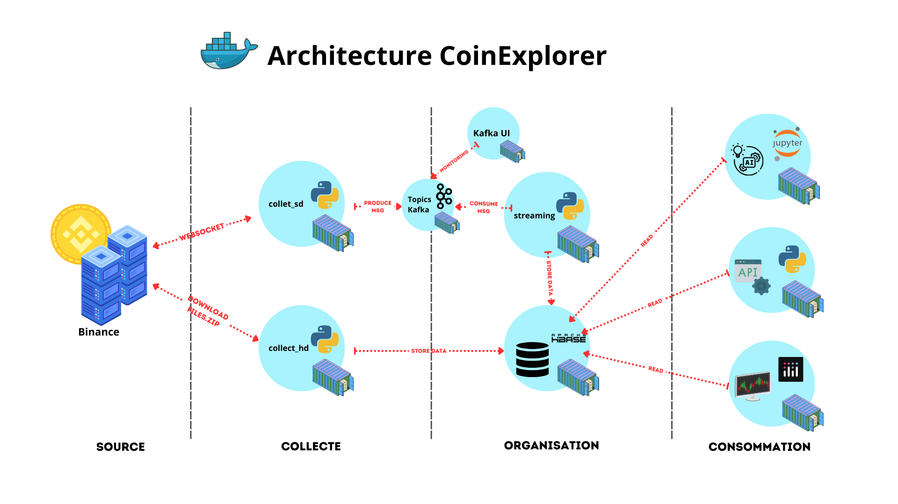

# CoinExplorer

## I. Description

CoinExplorer a pour objectif de permettre aux utilisateurs d’analyser les actifs numériques (Bitcoin, Etherum, Altcoin, etc) mis à disposition de la plateforme Binance et de pouvoir comparer les performances (rentabilité, précision, etc) des modèles de machine learning spécialisées dans la décision d’achat et de vente de cryptomonnaie.

## II. Pour commencer

Pour démarrer le projet CoinExplorer avec les options par défaut, vous devez exécuter l'instruction suivante :

`docker compose up --scale kafka=3 -d`

Cette instruction va démarrer un ensemble de services :

- `collect_hd` et `collect_sd` qui sont des services de collecte de données (respectivement des données historiques et des données temps réels).
- Un service `Hbase` qui sert de datalake.
- Un cluster `kafka` qui comprend un service `zookeeper`, 3 nœuds `kafka` avec `replications = 2`.
- Un `kafkaui` pour superviser les topics kafka.
- Un service `jupyter` pour utiliser, consulter et analyser les données du datalake Hbase.
- Un service `api` (fastApi), qui est une interface REST pour accéder aux données de Hbase.
- Un service `dashboard`, qui est une application Dash pour visualiser les données de Hbase en passant par le service api.

### III. Architecture

