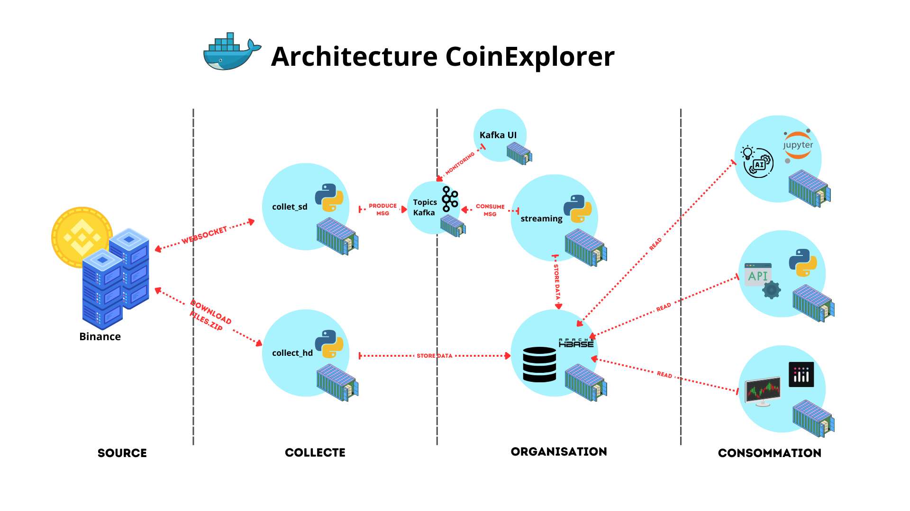

# CoinExplorer

## I. Description

CoinExplorer a pour objectif de permettre aux utilisateurs d’analyser les actifs numériques (Bitcoin, Etherum, Altcoin, etc) mis à disposition de la plateforme Binance et de pouvoir comparer les performances (rentabilité, précision, etc) des modèles de machine learning spécialisées dans la décision d’achat et de vente de cryptomonnaie.

## II. Pour commencer

Pour démarrer le projet CoinExplorer avec les options par défaut, vous devez exécuter l'instruction suivante :


`docker compose up --scale kafka=3 -d`


Cette instruction va démarrer un ensemble de services :

- `collect_hd` et `collect_sd` qui sont des services de collecte de données (respectivement des données historiques et des données temps réels).
- Un service `Hbase` qui sert de datalake.
- Un cluster `kafka` qui comprend un service `zookeeper`, 3 nœuds `kafka` avec `replications = 2`.
- Un `kafkaui` pour superviser les topics kafka.
- Un service `jupyter` pour utiliser, consulter et analyser les données du datalake Hbase.
- Un service `api` (fastApi), qui est une interface REST pour accéder aux données de Hbase.
- Un service `dashboard`, qui est une application Dash pour visualiser les données de Hbase en passant par le service api.


Pour demarrer des services ciblés :

`docker compose up -d collect_sd kafka kafkaui` 

Cette instruction démarre uniquement le service `collect_sd`, `kafka` et `kafkaui` 

Pour lister les services démarrés :

`docker container list -a`

Pour afficher les logs d'un service :

`docker logs <service_cible>


### III. Architecture



---

## IV. Gestion des logs

### Comment fonctionnent les logs dans ce projet ?

Le projet utilise la librairie standard Python `logging`. Chaque module déclare son propre logger nommé `logging.getLogger(__name__)`, ce qui donne des noms hiérarchiques automatiques (`opa.trading.steps.crossing`, `opa.storage.repository`, etc.).

La configuration centralisée est dans `src/opa/logging_config.py` et est appelée **une seule fois au démarrage** de chaque service. Le niveau de log est contrôlé par la variable d'environnement `LOG_LEVEL`.

```
opa                          ← logger racine du projet
├── opa.trading
│   ├── opa.trading.steps.crossing
│   ├── opa.trading.steps.trend
│   └── opa.trading.strategy
├── opa.storage
└── opa.process
```

Un seul `LOG_LEVEL=DEBUG` active le mode verbeux sur l'ensemble du projet.

### Comment bien logger ?

**1. Déclarer le logger en tête de chaque module :**
```python
import logging
logger = logging.getLogger(__name__)
```

**2. Choisir le bon niveau :**

| Niveau | Quand l'utiliser | Exemple |
|--------|-----------------|---------|
| `DEBUG` | Détail de flux interne, valeurs intermédiaires | `logger.debug("RSI=%.2f", rsi[-1])` |
| `INFO` | Événement métier significatif | `logger.info("MACD crossed above signal")` |
| `WARNING` | Anomalie récupérée (retry, donnée manquante) | `logger.warning("Retrying connection %d/%d", n, max)` |
| `ERROR` | Erreur inattendue ou perte de données | `logger.error("CSV file not found: %s", path)` |

**3. Préférer le format `%s` aux f-strings pour les messages de log :**
```python
# ✓ Lazy evaluation : le message n'est formaté que si le niveau est actif
logger.debug("price=%.4f, sma=%.4f", price[-1], sma[-1])

# ✗ Le f-string est évalué même si DEBUG est inactif (gaspillage)
logger.debug(f"price={price[-1]:.4f}, sma={sma[-1]:.4f}")
```

### Comment configurer le niveau de log ?

La variable d'environnement `LOG_LEVEL` contrôle le niveau global. Valeurs acceptées : `DEBUG`, `INFO`, `WARNING`, `ERROR`.

**En développement local :**
```bash
LOG_LEVEL=DEBUG python -m services.collectors.historic.binance_historic_data_collector -s BTCUSDT -i 5m ...
```

**Dans Docker Compose**, ajouter à la définition du service :
```yaml
services:
  collect_hd:
    environment:
      LOG_LEVEL: DEBUG
```

**Par défaut** (variable absente) : niveau `INFO`.

---

## V. Gestion des tests

### Comment écrire un test avec pytest ?

**Structure de base :**
```python
# tests/opa/trading/test_mon_module.py

def test_<ce_qui_est_testé>_<condition>():
    # 1. Arrange — préparer les données
    ind = SmaIndicator("5m", 20)
    closes = np.linspace(100.0, 200.0, 200)

    # 2. Act — appeler le code
    result = ind.value(None, None, closes)

    # 3. Assert — vérifier le résultat
    assert result[-1] == pytest.approx(195.0, rel=1e-3)
```

**Utiliser les fixtures partagées** (définies dans `tests/conftest.py`) :
```python
# La fixture 'price_arrays' est automatiquement injectée par pytest
def test_sma_shape(price_arrays):
    ind = SmaIndicator("5m", 20)
    result = ind.value(None, None, price_arrays["closes"])
    assert result.shape == price_arrays["closes"].shape

# La fixture 'filled_environment' fournit un Environment avec 200 candles + indicateurs
def test_step_success(filled_environment):
    step = CheckBullRunStep("5m-5m_SMA_20", "5m-5m_SMA_50", "5m-5m_RSI_14")
    ...
```

**Tester les exceptions :**
```python
def test_invalid_period_raises():
    with pytest.raises(ValueError):
        SmaIndicator("5m", 0)
```

**Principe clé** : préférer de vraies instances avec des données synthétiques numpy plutôt que des mocks. Cela teste le comportement réel du code et détecte les régressions.

### Commandes pytest principales

```bash
# Lancer tous les tests
pytest tests/

# Mode verbeux (affiche chaque test)
pytest tests/ -v

# Filtrer par nom (ex : tous les tests SMA)
pytest tests/ -k "test_sma"

# Lancer un seul module
pytest tests/opa/trading/test_indicators.py -v

# Avec couverture de code
pytest tests/ --cov=src/opa --cov-report=term-missing

# Stopper au premier échec
pytest tests/ -x
```